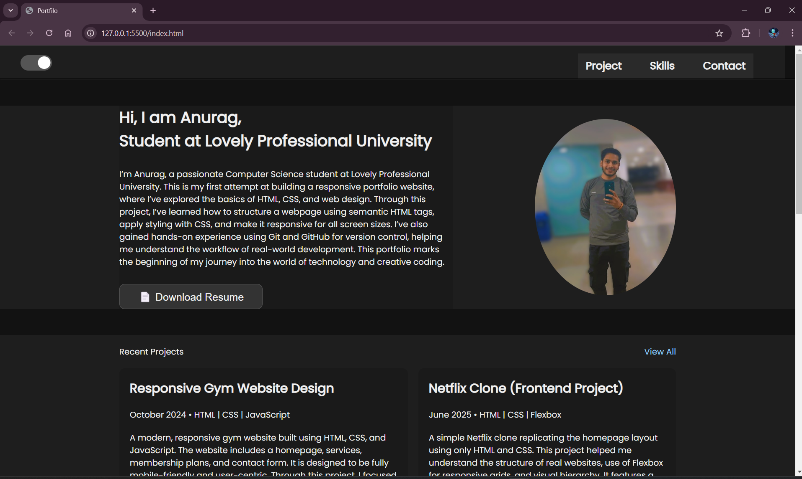

## 🚀 Responsive Landing Page

A clean, responsive landing page built using HTML, CSS, and JavaScript as part of *SkillCraft Internship – Task 1*.

## 🔧 Features

- Interactive and fixed navigation bar
- Menu icon toggles on click (hamburger to close)
- Responsive layout for all screen sizes
- Smooth scroll and section navigation
- Clean and modern UI

## 📁 Folder Structure

Responsive_Landing_Page/ ├── index.html ├── style.css ├── script.js ├── img/ ├── README.md

## 📸 Preview
.
  

## 💡 What I Learned

- Responsive design with media queries
- DOM manipulation with JavaScript
- Creating reusable components
- Navigation behavior on scroll and click

## 📌 How to Use

1. Clone this repo
2. Open index.html in a browser
3. Explore the responsiveness and navigation

---

> This project is part of the internship tasks at *SkillCraft*.

---

📍 To Add It:

1. Open VS Code inside your project folder

2. Create a new file named README.md
;
,
3. Paste the content above

4. Save it

5. Push your project again to GitHub

